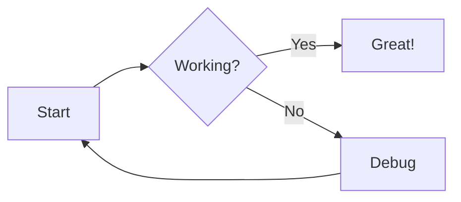

## Patch Nova: Match GitHub

This patch brings GitHub features to [Markdown previews in Nova][nova-doc] by adding support for:

- **GitHub Markdown Alerts**
- **Syntax Highlighting**
- **Mermaid Diagrams**

> [!tip]
> Also use this user stylesheet in Nova to bring the exact style of GitHub to Markdown previews: [`andesco/generate-github-markdown-css`][andesco]

## Usage

1. Install: `sudo swift patch-nova.swift install`

2. Quit and relaunch Nova.

```bash
sudo swift patch-nova.swift install # backup and install
swift patch-nova.swift status       # get status
swift patch-nova.swift update       # update
sudo swift patch-nova.swift restore # restore
```
> The included Swift script create a backup and patches the [userscript] used by Nova: `Nova.app/Contents/Resources/ExternalWebRuntime.js`


## GitHub Markdown Alerts

[GitHub Markdown Alerts][alerts] are based on the blockquote syntax that emphasize critical information. They are displayed with distinctive colors and icons to indicate the significance of the content.

```markdown
<!--markdown-->
[!NOTE]
> Useful information that users should know, even when skimming content.
```

> [!NOTE]
> Useful information that users should know, even when skimming content.

> [!TIP]
> Helpful advice for doing things better or more easily.

> [!IMPORTANT]
> Key information users need to know to achieve their goal.

> [!WARNING]
> Urgent info that needs immediate user attention to avoid problems.

> [!CAUTION]
> Advises about risks or negative outcomes of certain actions.

## Syntax Highlighting

Code blocks are automatically highlighted using [`starry-night`](https://github.com/wooorm/starry-night) with syntax-aware coloring that matches GitHub.


```markdown
‌```javascript
function greet(name) {
  console.log(`Hello, ${name}.`);
}
‌```
```

```javascript
function greet(name) {
  console.log(`Hello, ${name}.`);
}
```

## Mermaid Diagrams

[Mermaid](https://mermaid.js.org/) generates diagrams from text in a similar manner to Markdown.

```markdown
‌```mermaid
graph LR
  A[Start] --> B{Working?}
  B --> |Yes| C[Great!]
  B --> |No| D[Debug]
  D --> A
‌```
```



[andesco]: https://github.com/andesco/generate-github-markdown-css
[alerts]: https://docs.github.com/en/get-started/writing-on-github/getting-started-with-writing-and-formatting-on-github/basic-writing-and-formatting-syntax#alerts
[nova-doc]: https://help.nova.app/previews/web-server/
[userscript]: https://developer.mozilla.org/en-US/docs/Web/CSS/CSS_cascade/Cascade#user_stylesheets