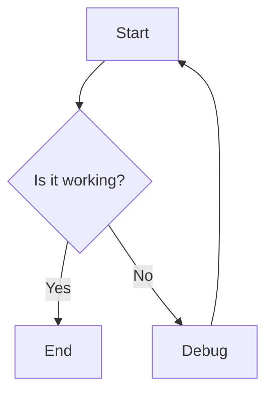

# Test Document

This file tests all the extensions added to Nova.

## GitHub Markdown Alerts

> [!NOTE]
> This is a note alert. Useful for highlighting information.

> [!TIP]
> This is a tip alert. Share helpful advice here.

> [!IMPORTANT]
> This is an important alert. Draw attention to crucial details.

> [!WARNING]
> This is a warning alert. Caution users about potential issues.

> [!CAUTION]
> This is a caution alert. Highlight critical risks.

## Syntax Highlighting

JavaScript example:
```javascript
function greet(name) {
  console.log(`Hello, ${name}!`);
  return true;
}

const result = greet('World');
```

Python example:
```python
def calculate_fibonacci(n):
    if n <= 1:
        return n
    return calculate_fibonacci(n-1) + calculate_fibonacci(n-2)

print(calculate_fibonacci(10))
```

## Mermaid Diagram

Flowchart:
